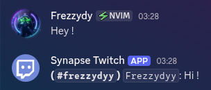
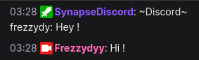

# Synapse Bot

<p align="center">
   
</p>

## Table of Content

- [About](#about)
- [Installation](#installation)
  - [Dependencies](#dependencies)
  - [Discord Bot](#discord-bot)
  - [Twitch App](#twitch-app)
  - [Initialization](#initialization)
- [Usage](#usage)
  - [Twitch](#twitch)
  - [Docker](#docker)
- [Licence](#licence)

## About

> [!NOTE]
> A Twitch App & Discord Bot that links Twich Chat with a Discord Channel

> [!WARNING]
> This is the Rust version. If you want to see the JavaScript version, check the [JS branch](https://github.com/YetAnotherMechanicusEnjoyer/SynapseBot/tree/js).

## Installation

### Dependencies

> [!IMPORTANT]
> Make sure to have [Docker](https://www.docker.com/) & [Docker Compose](https://docs.docker.com/compose/) installed.

### Discord Bot

> [!IMPORTANT]
> Make a Discord Bot on the [Discord Developper Portal](https://discord.com/developers/active-developer).
>
> Then, invite it to your Discord server.

### Twitch App

> [!IMPORTANT]
> Make a Twitch App on the [Twitch Console](https://dev.twitch.tv/console).
>
> Then, make an oauth token in [Twitch Token Generator](https://twitchtokengenerator.com) (you must be connected with your App's account).

### Initialization

> [!NOTE]
> Clone the repo somewhere and make a `.env` file at the root of the repository that contains the followig variables.

> [!TIP]
> Exemple of a `.env` file :

```env
TWITCH_BOT_USERNAME="your-twitch-bot-username"
TWITCH_OAUTH_TOKEN="oauth:your-twitch-oauth-token"
TWITCH_CHANNEL="streamers-channel-name"
DISCORD_BOT_TOKEN="your-discord-bot-token"
DISCORD_CHANNEL_ID="your-discord-channel-id"
```

## Usage

### Twitch

> [!TIP]
> Mod the app on your Twitch Chat to make Twitch API prioritize the App (optionnal).

```
/mod your-twitch-bot-username
```

### Docker

> [!NOTE]
> Run both the Twitch App & Discord Bot with [Docker Compose](https://docs.docker.com/compose/).

```bash
docker-compose up
```

## Licence

[MIT](https://github.com/YetAnotherMechanicusEnjoyer/SynapseBot/blob/471d506d441951272afa4067d1dc75349af5f129/LICENSE)
